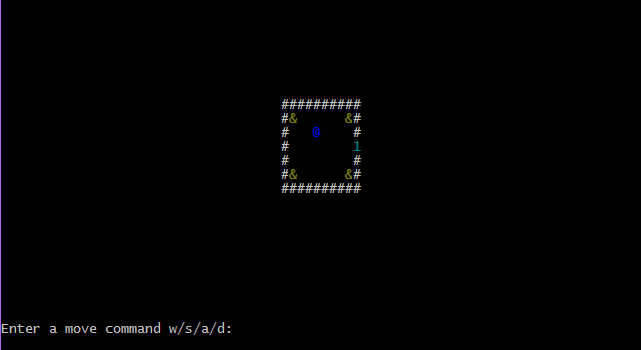

# VRogue
Simple rogue-like WIN32 game. 

# How to play #
### Who is who ###
| Sign | Character |
| ----- | ------ |
| **@** | player |
| **g** | goblin |
| **O** | ogre |
| **D** | dragon |
| **0-9** | door |

### Rules ###

* Move player with standard **w, s, a, d** buttons (you must switch to US/english language).
* Avoid or fight goblins and ogres. On the last level there will be a boss - dragon.

# Warning

This is currently a **_very-alpha_** version of this project, so, some features are in progress now, some bugs may appear and not all the maps are drawn.